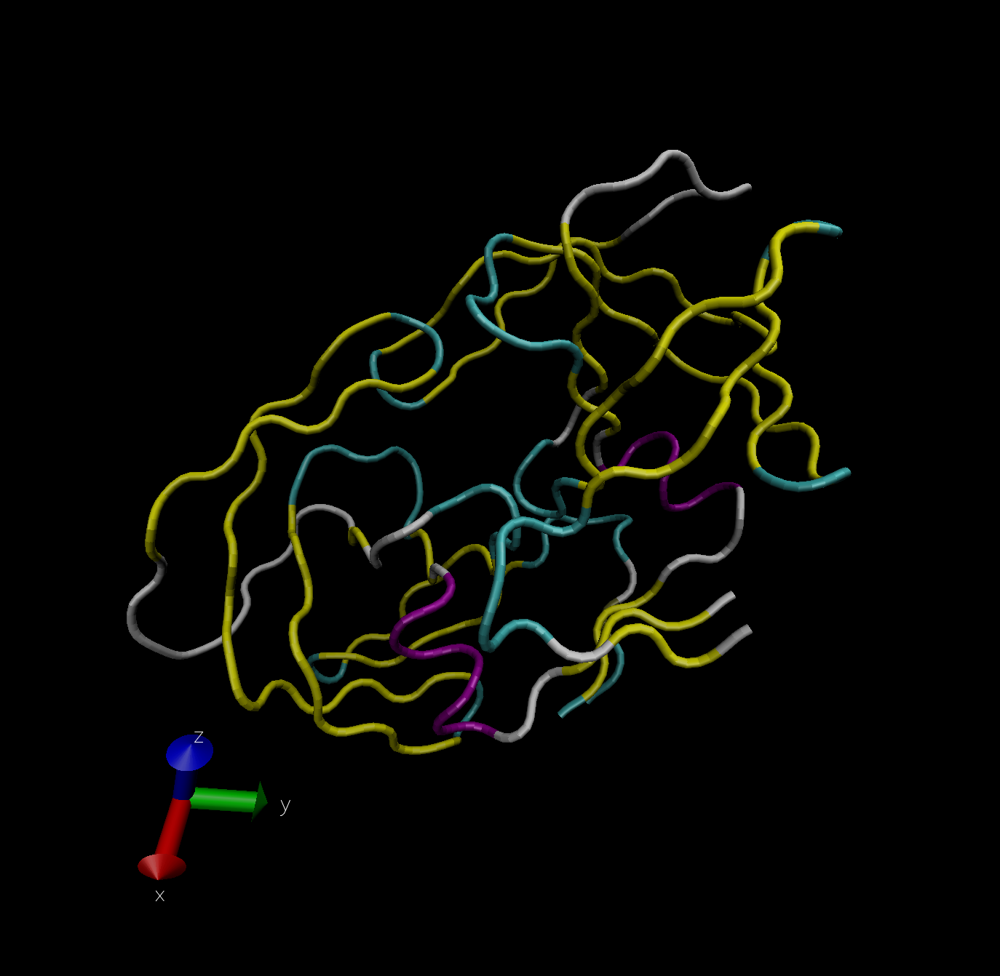

\#set the first column as the row names not a data column

```{r}
pdb.data <- read.csv("Data Export Summary.csv", row.names = 1)
pdb.data
```

\#Q1: What percentage of structures in the PDB are solved by X-Ray and Electron Microscopy.

```{r}
XR <- sum(pdb.data[,1])
XR
EM <- sum(pdb.data[,3])
EM
round(sum(XR)/sum(pdb.data[,7])*100,2)
round(sum(EM)/sum(pdb.data[,7])*100,2)
```

\#How about doing this over every method (i.e column in the little table)

\#can use pdb.data\$"name of the colum" instead of col position also

```{r}
round((colSums(pdb.data)/sum(pdb.data$Total))*100,2)
```

\#Q2: What proportion of structures in the PDB are protein?

```{r}
pdb.data$Total[1]
```

```{r}
round((pdb.data$Total[1]/sum(pdb.data$Total))*100,2)
```

# \#Q3: Type HIV in the PDB website search box on the home page and determine how many HIV-1 protease structures are in the current PDB?



\#Do a normal mode analysis (NMA) a prediction of the conformational variability and intrinsic dynamics of this protein

```{r}
library(bio3d)

pdb <- read.pdb("1hel")
pdb
```

```{r}
m <- nma(pdb)
plot(m)
```

\#make a little movie(trajectory) for viewing in VMD.

```{r}
mktrj(m, file="nma.pdb")
```


