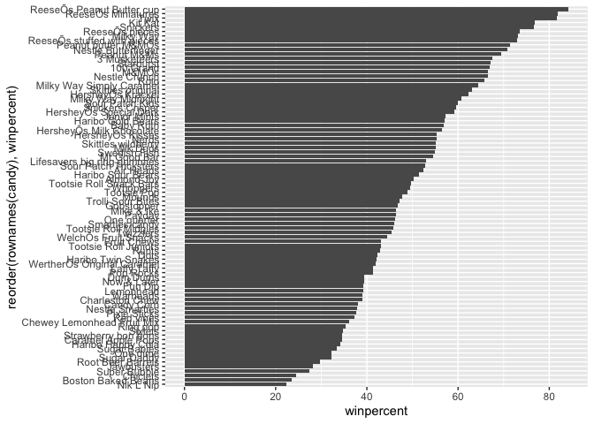
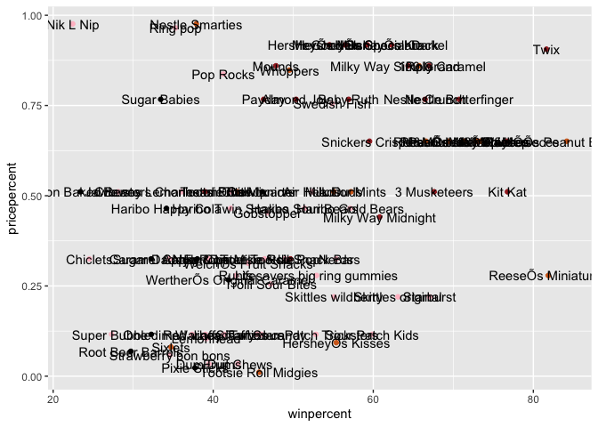
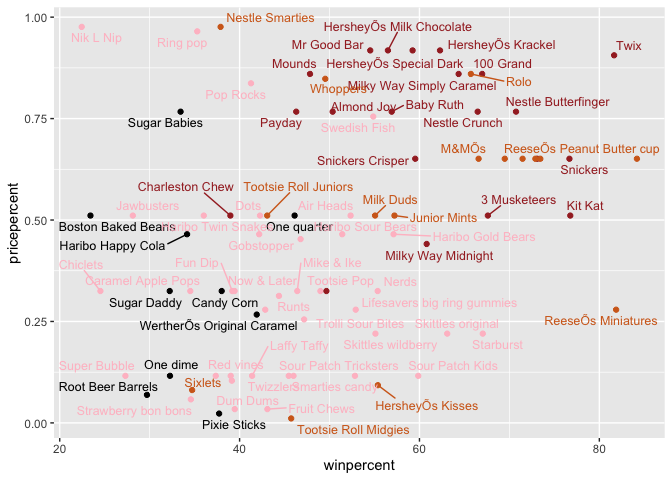
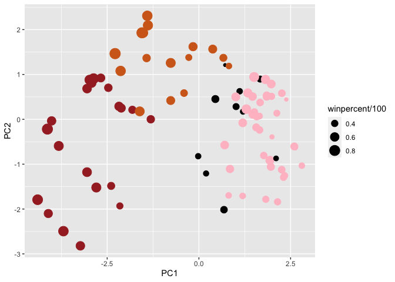
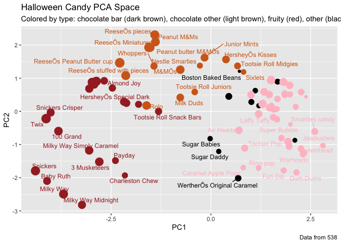

Class 10: Candy mini project
================
Caitriona Brennan
10/29/2021

``` r
candy_file <- "candy.csv"

candy =  read.csv(candy_file, row.names=1)
head(candy)
```

    ##              chocolate fruity caramel peanutyalmondy nougat crispedricewafer
    ## 100 Grand            1      0       1              0      0                1
    ## 3 Musketeers         1      0       0              0      1                0
    ## One dime             0      0       0              0      0                0
    ## One quarter          0      0       0              0      0                0
    ## Air Heads            0      1       0              0      0                0
    ## Almond Joy           1      0       0              1      0                0
    ##              hard bar pluribus sugarpercent pricepercent winpercent
    ## 100 Grand       0   1        0        0.732        0.860   66.97173
    ## 3 Musketeers    0   1        0        0.604        0.511   67.60294
    ## One dime        0   0        0        0.011        0.116   32.26109
    ## One quarter     0   0        0        0.011        0.511   46.11650
    ## Air Heads       0   0        0        0.906        0.511   52.34146
    ## Almond Joy      0   1        0        0.465        0.767   50.34755

\#Q1. How many different candy types are in this dataset? \#Answer 85

``` r
nrow(candy)
```

    ## [1] 85

\#Q2. How many fruity candy types are in the dataset?

``` r
sum(candy[,"fruity"])
```

    ## [1] 38

``` r
sum(candy[,"chocolate"])
```

    ## [1] 37

\#Q3. What is your favorite candy in the dataset and what is it’s
winpercent value?

``` r
candy["Almond Joy", ]$winpercent
```

    ## [1] 50.34755

Q4. What is the winpercent value for “Kit Kat”?

``` r
candy["Kit Kat", ]$winpercent
```

    ## [1] 76.7686

Q5. What is the winpercent value for “Tootsie Roll Snack Bars”?

``` r
candy["Tootsie Roll Snack Bars", ]$winpercent
```

    ## [1] 49.6535

\#side-note: the skimr::skim() function

There is a useful skim() function in the skimr package that can help
give you a quick overview of a given dataset. Let’s install this package
and try it on our candy data.

``` r
library(skimr)
skim(candy)
```

|                                                  |       |
|:-------------------------------------------------|:------|
| Name                                             | candy |
| Number of rows                                   | 85    |
| Number of columns                                | 12    |
| \_\_\_\_\_\_\_\_\_\_\_\_\_\_\_\_\_\_\_\_\_\_\_   |       |
| Column type frequency:                           |       |
| numeric                                          | 12    |
| \_\_\_\_\_\_\_\_\_\_\_\_\_\_\_\_\_\_\_\_\_\_\_\_ |       |
| Group variables                                  | None  |

Data summary

**Variable type: numeric**

| skim\_variable   | n\_missing | complete\_rate |  mean |    sd |    p0 |   p25 |   p50 |   p75 |  p100 | hist  |
|:-----------------|-----------:|---------------:|------:|------:|------:|------:|------:|------:|------:|:------|
| chocolate        |          0 |              1 |  0.44 |  0.50 |  0.00 |  0.00 |  0.00 |  1.00 |  1.00 | ▇▁▁▁▆ |
| fruity           |          0 |              1 |  0.45 |  0.50 |  0.00 |  0.00 |  0.00 |  1.00 |  1.00 | ▇▁▁▁▆ |
| caramel          |          0 |              1 |  0.16 |  0.37 |  0.00 |  0.00 |  0.00 |  0.00 |  1.00 | ▇▁▁▁▂ |
| peanutyalmondy   |          0 |              1 |  0.16 |  0.37 |  0.00 |  0.00 |  0.00 |  0.00 |  1.00 | ▇▁▁▁▂ |
| nougat           |          0 |              1 |  0.08 |  0.28 |  0.00 |  0.00 |  0.00 |  0.00 |  1.00 | ▇▁▁▁▁ |
| crispedricewafer |          0 |              1 |  0.08 |  0.28 |  0.00 |  0.00 |  0.00 |  0.00 |  1.00 | ▇▁▁▁▁ |
| hard             |          0 |              1 |  0.18 |  0.38 |  0.00 |  0.00 |  0.00 |  0.00 |  1.00 | ▇▁▁▁▂ |
| bar              |          0 |              1 |  0.25 |  0.43 |  0.00 |  0.00 |  0.00 |  0.00 |  1.00 | ▇▁▁▁▂ |
| pluribus         |          0 |              1 |  0.52 |  0.50 |  0.00 |  0.00 |  1.00 |  1.00 |  1.00 | ▇▁▁▁▇ |
| sugarpercent     |          0 |              1 |  0.48 |  0.28 |  0.01 |  0.22 |  0.47 |  0.73 |  0.99 | ▇▇▇▇▆ |
| pricepercent     |          0 |              1 |  0.47 |  0.29 |  0.01 |  0.26 |  0.47 |  0.65 |  0.98 | ▇▇▇▇▆ |
| winpercent       |          0 |              1 | 50.32 | 14.71 | 22.45 | 39.14 | 47.83 | 59.86 | 84.18 | ▃▇▆▅▂ |

\#QQ6. Is there any variable/column that looks to be on a different
scale to the majority of the other columns in the dataset? - Answer =
winpercent

\#Q7. What do you think a zero and one represent for the candy$chocolate
column? Answer = Absent and present

\#Q8. Plot a histogram of winpercent values

``` r
hist(candy$winpercent)
```

<!-- -->

\#Q9. Is the distribution of winpercent values symmetrical? No

\#Q10. Is the center of the distribution above or below 50%? Below

\#Q11. On average is chocolate candy higher or lower ranked than fruit
candy? Answer = Higher \#as logical to return which candy is chocolate

``` r
as.logical(candy$chocolate)
```

    ##  [1]  TRUE  TRUE FALSE FALSE FALSE  TRUE  TRUE FALSE FALSE FALSE  TRUE FALSE
    ## [13] FALSE FALSE FALSE FALSE FALSE FALSE FALSE FALSE FALSE FALSE  TRUE  TRUE
    ## [25]  TRUE  TRUE FALSE  TRUE  TRUE FALSE FALSE FALSE  TRUE  TRUE FALSE  TRUE
    ## [37]  TRUE  TRUE  TRUE  TRUE  TRUE FALSE  TRUE  TRUE FALSE FALSE FALSE  TRUE
    ## [49] FALSE FALSE FALSE  TRUE  TRUE  TRUE  TRUE FALSE  TRUE FALSE FALSE  TRUE
    ## [61] FALSE FALSE  TRUE FALSE  TRUE  TRUE FALSE FALSE FALSE FALSE FALSE FALSE
    ## [73] FALSE FALSE  TRUE  TRUE  TRUE  TRUE FALSE  TRUE FALSE FALSE FALSE FALSE
    ## [85]  TRUE

\#for all chocolate in candy what is the winpercent

``` r
candy[as.logical(candy$chocolate),"winpercent"]
```

    ##  [1] 66.97173 67.60294 50.34755 56.91455 38.97504 55.37545 62.28448 56.49050
    ##  [9] 59.23612 57.21925 76.76860 71.46505 66.57458 55.06407 73.09956 60.80070
    ## [17] 64.35334 47.82975 54.52645 70.73564 66.47068 69.48379 81.86626 84.18029
    ## [25] 73.43499 72.88790 65.71629 34.72200 37.88719 76.67378 59.52925 48.98265
    ## [33] 43.06890 45.73675 49.65350 81.64291 49.52411

\#get the average of these

``` r
chocolate <- candy[as.logical(candy$chocolate), "winpercent"]
mean(chocolate)
```

    ## [1] 60.92153

``` r
fruity <- candy[as.logical(candy$fruity), "winpercent"]
mean(fruity)
```

    ## [1] 44.11974

## Q12. Is this difference statistically significant? ans = Yes

\#it matters the order you put chocolate and candy.

``` r
t.test(chocolate, fruity)
```

    ## 
    ##  Welch Two Sample t-test
    ## 
    ## data:  chocolate and fruity
    ## t = 6.2582, df = 68.882, p-value = 2.871e-08
    ## alternative hypothesis: true difference in means is not equal to 0
    ## 95 percent confidence interval:
    ##  11.44563 22.15795
    ## sample estimates:
    ## mean of x mean of y 
    ##  60.92153  44.11974

\#3. Overall Candy Rankings Let’s use the base R order() function
together with head() to sort the whole dataset by winpercent. Or if you
have been getting into the tidyverse and the dplyr package you can use
the arrange() function together with head() to do the same thing and
answer the following questions:

Q15. Make a first barplot of candy ranking based on winpercent values.

``` r
library(ggplot2)
ggplot(candy) +
  aes(winpercent, rownames(candy)) +
  geom_col()
```

<!-- -->

\#we need to improve this to reorder the candy by the winpercent values
\#\#Q16. This is quite ugly, use the reorder() function to get the bars
sorted by winpercent?

``` r
library(ggplot2)
ggplot(candy) +
  aes(winpercent,reorder(rownames(candy), winpercent)) +
  geom_col()
```

<!-- -->

\#create colors for every candy type

``` r
my_cols=rep("black", nrow(candy))
my_cols[as.logical(candy$chocolate)] = "chocolate"
my_cols[as.logical(candy$bar)] = "brown"
my_cols[as.logical(candy$fruity)] = "pink"
```

``` r
ggplot(candy) + 
  aes(winpercent, reorder(rownames(candy),winpercent)) +
  geom_col(fill=my_cols)
```

<!-- -->

\#\#Q13. What are the five least liked candy types in this set?

``` r
head(candy[order(candy$winpercent),], n=5)
```

    ##                    chocolate fruity caramel peanutyalmondy nougat
    ## Nik L Nip                  0      1       0              0      0
    ## Boston Baked Beans         0      0       0              1      0
    ## Chiclets                   0      1       0              0      0
    ## Super Bubble               0      1       0              0      0
    ## Jawbusters                 0      1       0              0      0
    ##                    crispedricewafer hard bar pluribus sugarpercent pricepercent
    ## Nik L Nip                         0    0   0        1        0.197        0.976
    ## Boston Baked Beans                0    0   0        1        0.313        0.511
    ## Chiclets                          0    0   0        1        0.046        0.325
    ## Super Bubble                      0    0   0        0        0.162        0.116
    ## Jawbusters                        0    1   0        1        0.093        0.511
    ##                    winpercent
    ## Nik L Nip            22.44534
    ## Boston Baked Beans   23.41782
    ## Chiclets             24.52499
    ## Super Bubble         27.30386
    ## Jawbusters           28.12744

\#\#Q14. What are the top 5 all time favorite candy types out of this
set?

``` r
#candy %>% arrange(winpercent) %>% tail(5)
```

``` r
ggplot(candy) +
  aes(winpercent, pricepercent, label=rownames(candy)) +
  geom_point(col=my_cols) +
  geom_text()
```

<!-- -->

\#Q17. What is the worst ranked chocolate candy? Answer - Nik L Nip
\#Q18. What is the best ranked fruity candy? Answer - Reeses peanut
butter cup

\#4. Taking a look at pricepercent What about value for money? What is
the the best candy for the least money? One way to get at this would be
to make a plot of winpercent vs the pricepercent variable. The
pricepercent variable records the percentile rank of the candy’s price
against all the other candies in the dataset. Lower vales are less
expensive and high values more expensive.

To this plot we will add text labels so we can more easily identify a
given candy. There is a regular geom\_label() that comes with ggplot2.
However, as there are quite a few candys in our dataset lots of these
labels will be overlapping and hard to read. To help with this we can
use the geom\_text\_repel() function from the ggrepel package.

``` r
library(ggrepel)

ggplot(candy) +
  aes(winpercent, pricepercent, label=rownames(candy)) +
  geom_point(col=my_cols) + 
  geom_text_repel(col=my_cols, size=3.3, max.overlaps = 10)
```

    ## Warning: ggrepel: 10 unlabeled data points (too many overlaps). Consider
    ## increasing max.overlaps

<!-- -->
\#Q19. Which candy type is the highest ranked in terms of winpercent for
the least money - i.e. offers the most bang for your buck?

``` r
rownames(candy)
```

    ##  [1] "100 Grand"                   "3 Musketeers"               
    ##  [3] "One dime"                    "One quarter"                
    ##  [5] "Air Heads"                   "Almond Joy"                 
    ##  [7] "Baby Ruth"                   "Boston Baked Beans"         
    ##  [9] "Candy Corn"                  "Caramel Apple Pops"         
    ## [11] "Charleston Chew"             "Chewey Lemonhead Fruit Mix" 
    ## [13] "Chiclets"                    "Dots"                       
    ## [15] "Dum Dums"                    "Fruit Chews"                
    ## [17] "Fun Dip"                     "Gobstopper"                 
    ## [19] "Haribo Gold Bears"           "Haribo Happy Cola"          
    ## [21] "Haribo Sour Bears"           "Haribo Twin Snakes"         
    ## [23] "HersheyÕs Kisses"            "HersheyÕs Krackel"          
    ## [25] "HersheyÕs Milk Chocolate"    "HersheyÕs Special Dark"     
    ## [27] "Jawbusters"                  "Junior Mints"               
    ## [29] "Kit Kat"                     "Laffy Taffy"                
    ## [31] "Lemonhead"                   "Lifesavers big ring gummies"
    ## [33] "Peanut butter M&MÕs"         "M&MÕs"                      
    ## [35] "Mike & Ike"                  "Milk Duds"                  
    ## [37] "Milky Way"                   "Milky Way Midnight"         
    ## [39] "Milky Way Simply Caramel"    "Mounds"                     
    ## [41] "Mr Good Bar"                 "Nerds"                      
    ## [43] "Nestle Butterfinger"         "Nestle Crunch"              
    ## [45] "Nik L Nip"                   "Now & Later"                
    ## [47] "Payday"                      "Peanut M&Ms"                
    ## [49] "Pixie Sticks"                "Pop Rocks"                  
    ## [51] "Red vines"                   "ReeseÕs Miniatures"         
    ## [53] "ReeseÕs Peanut Butter cup"   "ReeseÕs pieces"             
    ## [55] "ReeseÕs stuffed with pieces" "Ring pop"                   
    ## [57] "Rolo"                        "Root Beer Barrels"          
    ## [59] "Runts"                       "Sixlets"                    
    ## [61] "Skittles original"           "Skittles wildberry"         
    ## [63] "Nestle Smarties"             "Smarties candy"             
    ## [65] "Snickers"                    "Snickers Crisper"           
    ## [67] "Sour Patch Kids"             "Sour Patch Tricksters"      
    ## [69] "Starburst"                   "Strawberry bon bons"        
    ## [71] "Sugar Babies"                "Sugar Daddy"                
    ## [73] "Super Bubble"                "Swedish Fish"               
    ## [75] "Tootsie Pop"                 "Tootsie Roll Juniors"       
    ## [77] "Tootsie Roll Midgies"        "Tootsie Roll Snack Bars"    
    ## [79] "Trolli Sour Bites"           "Twix"                       
    ## [81] "Twizzlers"                   "Warheads"                   
    ## [83] "WelchÕs Fruit Snacks"        "WertherÕs Original Caramel" 
    ## [85] "Whoppers"

\#change Õ in the rownames to a ’. gsub = global substitute

``` r
gsub("Õ", "'", rownames(candy))
```

    ##  [1] "100 Grand"                   "3 Musketeers"               
    ##  [3] "One dime"                    "One quarter"                
    ##  [5] "Air Heads"                   "Almond Joy"                 
    ##  [7] "Baby Ruth"                   "Boston Baked Beans"         
    ##  [9] "Candy Corn"                  "Caramel Apple Pops"         
    ## [11] "Charleston Chew"             "Chewey Lemonhead Fruit Mix" 
    ## [13] "Chiclets"                    "Dots"                       
    ## [15] "Dum Dums"                    "Fruit Chews"                
    ## [17] "Fun Dip"                     "Gobstopper"                 
    ## [19] "Haribo Gold Bears"           "Haribo Happy Cola"          
    ## [21] "Haribo Sour Bears"           "Haribo Twin Snakes"         
    ## [23] "Hershey's Kisses"            "Hershey's Krackel"          
    ## [25] "Hershey's Milk Chocolate"    "Hershey's Special Dark"     
    ## [27] "Jawbusters"                  "Junior Mints"               
    ## [29] "Kit Kat"                     "Laffy Taffy"                
    ## [31] "Lemonhead"                   "Lifesavers big ring gummies"
    ## [33] "Peanut butter M&M's"         "M&M's"                      
    ## [35] "Mike & Ike"                  "Milk Duds"                  
    ## [37] "Milky Way"                   "Milky Way Midnight"         
    ## [39] "Milky Way Simply Caramel"    "Mounds"                     
    ## [41] "Mr Good Bar"                 "Nerds"                      
    ## [43] "Nestle Butterfinger"         "Nestle Crunch"              
    ## [45] "Nik L Nip"                   "Now & Later"                
    ## [47] "Payday"                      "Peanut M&Ms"                
    ## [49] "Pixie Sticks"                "Pop Rocks"                  
    ## [51] "Red vines"                   "Reese's Miniatures"         
    ## [53] "Reese's Peanut Butter cup"   "Reese's pieces"             
    ## [55] "Reese's stuffed with pieces" "Ring pop"                   
    ## [57] "Rolo"                        "Root Beer Barrels"          
    ## [59] "Runts"                       "Sixlets"                    
    ## [61] "Skittles original"           "Skittles wildberry"         
    ## [63] "Nestle Smarties"             "Smarties candy"             
    ## [65] "Snickers"                    "Snickers Crisper"           
    ## [67] "Sour Patch Kids"             "Sour Patch Tricksters"      
    ## [69] "Starburst"                   "Strawberry bon bons"        
    ## [71] "Sugar Babies"                "Sugar Daddy"                
    ## [73] "Super Bubble"                "Swedish Fish"               
    ## [75] "Tootsie Pop"                 "Tootsie Roll Juniors"       
    ## [77] "Tootsie Roll Midgies"        "Tootsie Roll Snack Bars"    
    ## [79] "Trolli Sour Bites"           "Twix"                       
    ## [81] "Twizzlers"                   "Warheads"                   
    ## [83] "Welch's Fruit Snacks"        "Werther's Original Caramel" 
    ## [85] "Whoppers"

``` r
ord <- order(candy$pricepercent, decreasing = FALSE)
head( candy[ord,c(11,12)], n=5 )
```

    ##                      pricepercent winpercent
    ## Tootsie Roll Midgies        0.011   45.73675
    ## Pixie Sticks                0.023   37.72234
    ## Dum Dums                    0.034   39.46056
    ## Fruit Chews                 0.034   43.08892
    ## Strawberry bon bons         0.058   34.57899

Q20. What are the top 5 most expensive candy types in the dataset and of
these which is the least popular?

``` r
ord <- order(candy$pricepercent, decreasing = TRUE)
head( candy[ord,c(11,12)], n=5 )
```

    ##                          pricepercent winpercent
    ## Nik L Nip                       0.976   22.44534
    ## Nestle Smarties                 0.976   37.88719
    ## Ring pop                        0.965   35.29076
    ## HersheyÕs Krackel               0.918   62.28448
    ## HersheyÕs Milk Chocolate        0.918   56.49050

``` r
library(corrplot)
```

    ## corrplot 0.91 loaded

\#correlation structure

``` r
cij <- cor(candy)
corrplot(cij)
```

<!-- -->
\#\#Q22. Examining this plot what two variables are anti-correlated
(i.e. have minus values)? Fruity and Chocolate

\#\#Q23. Similarly, what two variables are most positively correlated?
Answer = Chocolate and Bar

\#PCA using prcomp \#need to scale the data and use summary to see it
Side-note: Feel free to examine what happens if you leave this argument
out (i.e. use the default scale=FALSE). Then examine the summary(pca)
and pca$rotation\[,1\] component and see that it is dominated by
winpercent (which is after all measured on a very different scale than
the other variables).

``` r
pca <- prcomp(candy, scale =TRUE)
summary(pca)
```

    ## Importance of components:
    ##                           PC1    PC2    PC3     PC4    PC5     PC6     PC7
    ## Standard deviation     2.0788 1.1378 1.1092 1.07533 0.9518 0.81923 0.81530
    ## Proportion of Variance 0.3601 0.1079 0.1025 0.09636 0.0755 0.05593 0.05539
    ## Cumulative Proportion  0.3601 0.4680 0.5705 0.66688 0.7424 0.79830 0.85369
    ##                            PC8     PC9    PC10    PC11    PC12
    ## Standard deviation     0.74530 0.67824 0.62349 0.43974 0.39760
    ## Proportion of Variance 0.04629 0.03833 0.03239 0.01611 0.01317
    ## Cumulative Proportion  0.89998 0.93832 0.97071 0.98683 1.00000

``` r
plot(pca$x[,1:2], col=my_cols, pch=16)
```

<!-- -->

\#can make a nicer plot with ggplot. need a input data.frame that
includes a seperate column for each of the aesthetics you would like
displayed. To accomplish this we make a new data.frame here that
contains our PCA results with all the rest of our candy data. We will
then use this for making plots below cbind is combining candy df and pca
1 -3

``` r
my_data <- cbind(candy, pca$x[,1:3])
my_data
```

    ##                             chocolate fruity caramel peanutyalmondy nougat
    ## 100 Grand                           1      0       1              0      0
    ## 3 Musketeers                        1      0       0              0      1
    ## One dime                            0      0       0              0      0
    ## One quarter                         0      0       0              0      0
    ## Air Heads                           0      1       0              0      0
    ## Almond Joy                          1      0       0              1      0
    ## Baby Ruth                           1      0       1              1      1
    ## Boston Baked Beans                  0      0       0              1      0
    ## Candy Corn                          0      0       0              0      0
    ## Caramel Apple Pops                  0      1       1              0      0
    ## Charleston Chew                     1      0       0              0      1
    ## Chewey Lemonhead Fruit Mix          0      1       0              0      0
    ## Chiclets                            0      1       0              0      0
    ## Dots                                0      1       0              0      0
    ## Dum Dums                            0      1       0              0      0
    ## Fruit Chews                         0      1       0              0      0
    ## Fun Dip                             0      1       0              0      0
    ## Gobstopper                          0      1       0              0      0
    ## Haribo Gold Bears                   0      1       0              0      0
    ## Haribo Happy Cola                   0      0       0              0      0
    ## Haribo Sour Bears                   0      1       0              0      0
    ## Haribo Twin Snakes                  0      1       0              0      0
    ## HersheyÕs Kisses                    1      0       0              0      0
    ## HersheyÕs Krackel                   1      0       0              0      0
    ## HersheyÕs Milk Chocolate            1      0       0              0      0
    ## HersheyÕs Special Dark              1      0       0              0      0
    ## Jawbusters                          0      1       0              0      0
    ## Junior Mints                        1      0       0              0      0
    ## Kit Kat                             1      0       0              0      0
    ## Laffy Taffy                         0      1       0              0      0
    ## Lemonhead                           0      1       0              0      0
    ## Lifesavers big ring gummies         0      1       0              0      0
    ## Peanut butter M&MÕs                 1      0       0              1      0
    ## M&MÕs                               1      0       0              0      0
    ## Mike & Ike                          0      1       0              0      0
    ## Milk Duds                           1      0       1              0      0
    ## Milky Way                           1      0       1              0      1
    ## Milky Way Midnight                  1      0       1              0      1
    ## Milky Way Simply Caramel            1      0       1              0      0
    ## Mounds                              1      0       0              0      0
    ## Mr Good Bar                         1      0       0              1      0
    ## Nerds                               0      1       0              0      0
    ## Nestle Butterfinger                 1      0       0              1      0
    ## Nestle Crunch                       1      0       0              0      0
    ## Nik L Nip                           0      1       0              0      0
    ## Now & Later                         0      1       0              0      0
    ## Payday                              0      0       0              1      1
    ## Peanut M&Ms                         1      0       0              1      0
    ## Pixie Sticks                        0      0       0              0      0
    ## Pop Rocks                           0      1       0              0      0
    ## Red vines                           0      1       0              0      0
    ## ReeseÕs Miniatures                  1      0       0              1      0
    ## ReeseÕs Peanut Butter cup           1      0       0              1      0
    ## ReeseÕs pieces                      1      0       0              1      0
    ## ReeseÕs stuffed with pieces         1      0       0              1      0
    ## Ring pop                            0      1       0              0      0
    ## Rolo                                1      0       1              0      0
    ## Root Beer Barrels                   0      0       0              0      0
    ## Runts                               0      1       0              0      0
    ## Sixlets                             1      0       0              0      0
    ## Skittles original                   0      1       0              0      0
    ## Skittles wildberry                  0      1       0              0      0
    ## Nestle Smarties                     1      0       0              0      0
    ## Smarties candy                      0      1       0              0      0
    ## Snickers                            1      0       1              1      1
    ## Snickers Crisper                    1      0       1              1      0
    ## Sour Patch Kids                     0      1       0              0      0
    ## Sour Patch Tricksters               0      1       0              0      0
    ## Starburst                           0      1       0              0      0
    ## Strawberry bon bons                 0      1       0              0      0
    ## Sugar Babies                        0      0       1              0      0
    ## Sugar Daddy                         0      0       1              0      0
    ## Super Bubble                        0      1       0              0      0
    ## Swedish Fish                        0      1       0              0      0
    ## Tootsie Pop                         1      1       0              0      0
    ## Tootsie Roll Juniors                1      0       0              0      0
    ## Tootsie Roll Midgies                1      0       0              0      0
    ## Tootsie Roll Snack Bars             1      0       0              0      0
    ## Trolli Sour Bites                   0      1       0              0      0
    ## Twix                                1      0       1              0      0
    ## Twizzlers                           0      1       0              0      0
    ## Warheads                            0      1       0              0      0
    ## WelchÕs Fruit Snacks                0      1       0              0      0
    ## WertherÕs Original Caramel          0      0       1              0      0
    ## Whoppers                            1      0       0              0      0
    ##                             crispedricewafer hard bar pluribus sugarpercent
    ## 100 Grand                                  1    0   1        0        0.732
    ## 3 Musketeers                               0    0   1        0        0.604
    ## One dime                                   0    0   0        0        0.011
    ## One quarter                                0    0   0        0        0.011
    ## Air Heads                                  0    0   0        0        0.906
    ## Almond Joy                                 0    0   1        0        0.465
    ## Baby Ruth                                  0    0   1        0        0.604
    ## Boston Baked Beans                         0    0   0        1        0.313
    ## Candy Corn                                 0    0   0        1        0.906
    ## Caramel Apple Pops                         0    0   0        0        0.604
    ## Charleston Chew                            0    0   1        0        0.604
    ## Chewey Lemonhead Fruit Mix                 0    0   0        1        0.732
    ## Chiclets                                   0    0   0        1        0.046
    ## Dots                                       0    0   0        1        0.732
    ## Dum Dums                                   0    1   0        0        0.732
    ## Fruit Chews                                0    0   0        1        0.127
    ## Fun Dip                                    0    1   0        0        0.732
    ## Gobstopper                                 0    1   0        1        0.906
    ## Haribo Gold Bears                          0    0   0        1        0.465
    ## Haribo Happy Cola                          0    0   0        1        0.465
    ## Haribo Sour Bears                          0    0   0        1        0.465
    ## Haribo Twin Snakes                         0    0   0        1        0.465
    ## HersheyÕs Kisses                           0    0   0        1        0.127
    ## HersheyÕs Krackel                          1    0   1        0        0.430
    ## HersheyÕs Milk Chocolate                   0    0   1        0        0.430
    ## HersheyÕs Special Dark                     0    0   1        0        0.430
    ## Jawbusters                                 0    1   0        1        0.093
    ## Junior Mints                               0    0   0        1        0.197
    ## Kit Kat                                    1    0   1        0        0.313
    ## Laffy Taffy                                0    0   0        0        0.220
    ## Lemonhead                                  0    1   0        0        0.046
    ## Lifesavers big ring gummies                0    0   0        0        0.267
    ## Peanut butter M&MÕs                        0    0   0        1        0.825
    ## M&MÕs                                      0    0   0        1        0.825
    ## Mike & Ike                                 0    0   0        1        0.872
    ## Milk Duds                                  0    0   0        1        0.302
    ## Milky Way                                  0    0   1        0        0.604
    ## Milky Way Midnight                         0    0   1        0        0.732
    ## Milky Way Simply Caramel                   0    0   1        0        0.965
    ## Mounds                                     0    0   1        0        0.313
    ## Mr Good Bar                                0    0   1        0        0.313
    ## Nerds                                      0    1   0        1        0.848
    ## Nestle Butterfinger                        0    0   1        0        0.604
    ## Nestle Crunch                              1    0   1        0        0.313
    ## Nik L Nip                                  0    0   0        1        0.197
    ## Now & Later                                0    0   0        1        0.220
    ## Payday                                     0    0   1        0        0.465
    ## Peanut M&Ms                                0    0   0        1        0.593
    ## Pixie Sticks                               0    0   0        1        0.093
    ## Pop Rocks                                  0    1   0        1        0.604
    ## Red vines                                  0    0   0        1        0.581
    ## ReeseÕs Miniatures                         0    0   0        0        0.034
    ## ReeseÕs Peanut Butter cup                  0    0   0        0        0.720
    ## ReeseÕs pieces                             0    0   0        1        0.406
    ## ReeseÕs stuffed with pieces                0    0   0        0        0.988
    ## Ring pop                                   0    1   0        0        0.732
    ## Rolo                                       0    0   0        1        0.860
    ## Root Beer Barrels                          0    1   0        1        0.732
    ## Runts                                      0    1   0        1        0.872
    ## Sixlets                                    0    0   0        1        0.220
    ## Skittles original                          0    0   0        1        0.941
    ## Skittles wildberry                         0    0   0        1        0.941
    ## Nestle Smarties                            0    0   0        1        0.267
    ## Smarties candy                             0    1   0        1        0.267
    ## Snickers                                   0    0   1        0        0.546
    ## Snickers Crisper                           1    0   1        0        0.604
    ## Sour Patch Kids                            0    0   0        1        0.069
    ## Sour Patch Tricksters                      0    0   0        1        0.069
    ## Starburst                                  0    0   0        1        0.151
    ## Strawberry bon bons                        0    1   0        1        0.569
    ## Sugar Babies                               0    0   0        1        0.965
    ## Sugar Daddy                                0    0   0        0        0.418
    ## Super Bubble                               0    0   0        0        0.162
    ## Swedish Fish                               0    0   0        1        0.604
    ## Tootsie Pop                                0    1   0        0        0.604
    ## Tootsie Roll Juniors                       0    0   0        0        0.313
    ## Tootsie Roll Midgies                       0    0   0        1        0.174
    ## Tootsie Roll Snack Bars                    0    0   1        0        0.465
    ## Trolli Sour Bites                          0    0   0        1        0.313
    ## Twix                                       1    0   1        0        0.546
    ## Twizzlers                                  0    0   0        0        0.220
    ## Warheads                                   0    1   0        0        0.093
    ## WelchÕs Fruit Snacks                       0    0   0        1        0.313
    ## WertherÕs Original Caramel                 0    1   0        0        0.186
    ## Whoppers                                   1    0   0        1        0.872
    ##                             pricepercent winpercent         PC1           PC2
    ## 100 Grand                          0.860   66.97173 -3.81986175 -0.5935787670
    ## 3 Musketeers                       0.511   67.60294 -2.79602364 -1.5196062111
    ## One dime                           0.116   32.26109  1.20258363  0.1718120657
    ## One quarter                        0.511   46.11650  0.44865378  0.4519735621
    ## Air Heads                          0.511   52.34146  0.70289922 -0.5731343263
    ## Almond Joy                         0.767   50.34755 -2.46833834  0.7035501120
    ## Baby Ruth                          0.767   56.91455 -4.10531223 -2.1000967736
    ## Boston Baked Beans                 0.511   23.41782  0.71385813  1.2098216537
    ## Candy Corn                         0.325   38.01096  1.01357204  0.2834319621
    ## Caramel Apple Pops                 0.325   34.51768  0.81049645 -1.6960889498
    ## Charleston Chew                    0.511   38.97504 -2.15436587 -1.9304213037
    ## Chewey Lemonhead Fruit Mix         0.511   36.01763  1.65268482  0.0726434944
    ## Chiclets                           0.325   24.52499  2.38180817  0.4430926071
    ## Dots                               0.511   42.27208  1.51249936  0.1623958592
    ## Dum Dums                           0.034   39.46056  2.14430933 -1.8388386160
    ## Fruit Chews                        0.034   43.08892  2.26133763  0.5818322520
    ## Fun Dip                            0.325   39.18550  1.82383348 -1.7828662094
    ## Gobstopper                         0.453   46.78335  1.96047812 -1.0584680267
    ## Haribo Gold Bears                  0.465   57.11974  1.33360746  0.5892699921
    ## Haribo Happy Cola                  0.465   34.15896  1.11167365  0.6257697808
    ## Haribo Sour Bears                  0.465   51.41243  1.46152952  0.5073691482
    ## Haribo Twin Snakes                 0.465   42.17877  1.66849016  0.3748646265
    ## HersheyÕs Kisses                   0.093   55.37545  0.37722675  1.5654519145
    ## HersheyÕs Krackel                  0.918   62.28448 -3.04788356  0.6850792787
    ## HersheyÕs Milk Chocolate           0.918   56.49050 -2.11696417  0.2504568891
    ## HersheyÕs Special Dark             0.918   59.23612 -2.17850376  0.2898570052
    ## Jawbusters                         0.511   28.12744  2.62491587 -0.6343671618
    ## Junior Mints                       0.511   57.21925 -0.16010610  1.6194428347
    ## Kit Kat                            0.511   76.76860 -2.87086546  0.9069655335
    ## Laffy Taffy                        0.116   41.38956  1.65450042 -0.2379605144
    ## Lemonhead                          0.104   39.14106  2.33564695 -1.2553404646
    ## Lifesavers big ring gummies        0.279   52.91139  1.19528766 -0.0783610246
    ## Peanut butter M&MÕs                0.651   71.46505 -1.52223814  1.9291395890
    ## M&MÕs                              0.651   66.57458 -0.76747561  1.2573539136
    ## Mike & Ike                         0.325   46.41172  1.57487290  0.0664259746
    ## Milk Duds                          0.511   55.06407 -0.76836937  0.4192793946
    ## Milky Way                          0.651   73.09956 -3.69272218 -2.4933313173
    ## Milky Way Midnight                 0.441   60.80070 -3.23036513 -2.8201031327
    ## Milky Way Simply Caramel           0.860   64.35334 -3.04936226 -1.1774777304
    ## Mounds                             0.860   47.82975 -1.81292795  0.2120726312
    ## Mr Good Bar                        0.918   54.52645 -2.67327849  0.9217207344
    ## Nerds                              0.325   55.35405  1.93426895 -0.9133307225
    ## Nestle Butterfinger                0.767   70.73564 -2.97855081  0.8798835368
    ## Nestle Crunch                      0.767   66.47068 -2.92740488  0.8119013154
    ## Nik L Nip                          0.976   22.44534  1.63985272  0.4210217322
    ## Now & Later                        0.325   39.44680  1.98070982  0.5117150919
    ## Payday                             0.767   46.29660 -2.39180556 -1.4839637512
    ## Peanut M&Ms                        0.651   69.48379 -1.38897069  2.0947188031
    ## Pixie Sticks                       0.023   37.72234  1.67042227  0.8969792365
    ## Pop Rocks                          0.837   41.26551  1.76879348 -0.8060325640
    ## Red vines                          0.116   37.34852  2.12406849  0.1366822960
    ## ReeseÕs Miniatures                 0.279   81.86626 -1.55210251  1.9287569793
    ## ReeseÕs Peanut Butter cup          0.651   84.18029 -2.28427985  1.4648923293
    ## ReeseÕs pieces                     0.651   73.43499 -1.40590761  2.3077984818
    ## ReeseÕs stuffed with pieces        0.651   72.88790 -2.13382398  1.0787289654
    ## Ring pop                           0.965   35.29076  1.19274412 -1.7069749284
    ## Rolo                               0.860   65.71629 -1.61259322  0.1773734932
    ## Root Beer Barrels                  0.069   29.70369  2.10440254 -0.8711340556
    ## Runts                              0.279   42.84914  2.25699185 -1.1223199934
    ## Sixlets                            0.081   34.72200  0.81799664  1.1888290122
    ## Skittles original                  0.220   63.08514  1.29259129  0.2263705137
    ## Skittles wildberry                 0.220   55.10370  1.47148517  0.1118354559
    ## Nestle Smarties                    0.976   37.88719 -0.27556563  1.3792344137
    ## Smarties candy                     0.116   45.99583  2.60115214 -0.6047947520
    ## Snickers                           0.651   76.67378 -4.39576792 -1.7919312516
    ## Snickers Crisper                   0.651   59.52925 -4.01457335 -0.0347673522
    ## Sour Patch Kids                    0.116   59.86400  1.81551769  0.8879445215
    ## Sour Patch Tricksters              0.116   52.82595  1.97326660  0.7869473239
    ## Starburst                          0.220   67.03763  1.50658493  0.9437290830
    ## Strawberry bon bons                0.058   34.57899  2.80647837 -1.0331193111
    ## Sugar Babies                       0.767   33.43755 -0.01900559 -0.8219542293
    ## Sugar Daddy                        0.325   32.23100  0.19642038 -1.2073694698
    ## Super Bubble                       0.116   27.30386  1.99242820 -0.3915898648
    ## Swedish Fish                       0.755   54.86111  1.00547407  0.5003327040
    ## Tootsie Pop                        0.325   48.98265  0.84734171 -1.1060686710
    ## Tootsie Roll Juniors               0.511   43.06890 -0.40463667  0.5848580362
    ## Tootsie Roll Midgies               0.011   45.73675  0.66730732  1.3709464980
    ## Tootsie Roll Snack Bars            0.325   49.65350 -1.31149842  0.0009721286
    ## Trolli Sour Bites                  0.255   47.17323  1.85048456  0.5304055168
    ## Twix                               0.906   81.64291 -4.12909044 -0.2180299573
    ## Twizzlers                          0.116   45.46628  1.56312584 -0.1794588354
    ## Warheads                           0.116   39.01190  2.30707033 -1.2940268825
    ## WelchÕs Fruit Snacks               0.313   44.37552  1.84808801  0.5022006184
    ## WertherÕs Original Caramel         0.267   41.90431  0.68420363 -2.0146385440
    ## Whoppers                           0.848   49.52411 -1.42549552  1.3654147702
    ##                                      PC3
    ## 100 Grand                    2.186308676
    ## 3 Musketeers                -1.412198551
    ## One dime                    -2.060771178
    ## One quarter                 -1.476492844
    ## Air Heads                    0.929389343
    ## Almond Joy                  -0.858108916
    ## Baby Ruth                   -1.347834706
    ## Boston Baked Beans          -0.941899950
    ## Candy Corn                   0.840681586
    ## Caramel Apple Pops           0.207020586
    ## Charleston Chew             -1.675469334
    ## Chewey Lemonhead Fruit Mix   0.909617411
    ## Chiclets                    -1.000422079
    ## Dots                         0.967135199
    ## Dum Dums                     0.385372660
    ## Fruit Chews                 -0.978626618
    ## Fun Dip                      0.719415821
    ## Gobstopper                   1.873874385
    ## Haribo Gold Bears            0.431929774
    ## Haribo Happy Cola           -0.054459647
    ## Haribo Sour Bears            0.379443632
    ## Haribo Twin Snakes           0.294528131
    ## HersheyÕs Kisses            -1.104739528
    ## HersheyÕs Krackel            1.154357778
    ## HersheyÕs Milk Chocolate    -0.218316614
    ## HersheyÕs Special Dark      -0.193067056
    ## Jawbusters                  -0.114043053
    ## Junior Mints                -0.442156347
    ## Kit Kat                      0.545771148
    ## Laffy Taffy                 -1.217408326
    ## Lemonhead                   -1.125823900
    ## Lifesavers big ring gummies -0.814040659
    ## Peanut butter M&MÕs          0.815897653
    ## M&MÕs                        1.260658369
    ## Mike & Ike                   1.114406454
    ## Milk Duds                    0.137573021
    ## Milky Way                   -0.843423990
    ## Milky Way Midnight          -0.902884388
    ## Milky Way Simply Caramel     1.382617058
    ## Mounds                      -0.636094539
    ## Mr Good Bar                 -0.997161433
    ## Nerds                        1.670281710
    ## Nestle Butterfinger         -0.348599786
    ## Nestle Crunch                0.747159803
    ## Nik L Nip                    0.083217936
    ## Now & Later                 -0.460099768
    ## Payday                      -2.091687409
    ## Peanut M&Ms                  0.260214925
    ## Pixie Sticks                -1.394703254
    ## Pop Rocks                    1.567639814
    ## Red vines                    0.115183020
    ## ReeseÕs Miniatures          -1.884620322
    ## ReeseÕs Peanut Butter cup    0.156138940
    ## ReeseÕs pieces              -0.136661895
    ## ReeseÕs stuffed with pieces  0.673152403
    ## Ring pop                     1.423826969
    ## Rolo                         1.931879747
    ## Root Beer Barrels            0.594335570
    ## Runts                        1.557678507
    ## Sixlets                     -1.093105891
    ## Skittles original            1.306145308
    ## Skittles wildberry           1.232745536
    ## Nestle Smarties              0.080047831
    ## Smarties candy              -0.003482896
    ## Snickers                    -1.434654778
    ## Snickers Crisper             1.089868643
    ## Sour Patch Kids             -0.863881832
    ## Sour Patch Tricksters       -0.928605869
    ## Starburst                   -0.487658690
    ## Strawberry bon bons          0.524069119
    ## Sugar Babies                 1.802826526
    ## Sugar Daddy                 -0.520140143
    ## Super Bubble                -1.481310204
    ## Swedish Fish                 1.068588828
    ## Tootsie Pop                  0.480874078
    ## Tootsie Roll Juniors        -0.836999949
    ## Tootsie Roll Midgies        -1.179339290
    ## Tootsie Roll Snack Bars     -0.885976952
    ## Trolli Sour Bites           -0.254559391
    ## Twix                         1.943536689
    ## Twizzlers                   -1.179917535
    ## Warheads                    -1.004249910
    ## WelchÕs Fruit Snacks        -0.213204782
    ## WertherÕs Original Caramel  -0.506488679
    ## Whoppers                     2.759982292

``` r
p <- ggplot(my_data) + 
        aes(x=PC1, y=PC2, 
            size=winpercent/100,  
            text=rownames(my_data),
            label=rownames(my_data)) +
        geom_point(col=my_cols)

p
```

<!-- -->

``` r
library(ggrepel)

p + geom_text_repel(size=3.3, col=my_cols, max.overlaps = 7)  + 
  theme(legend.position = "none") +
  labs(title="Halloween Candy PCA Space",
       subtitle="Colored by type: chocolate bar (dark brown), chocolate other (light brown), fruity (red), other (black)",
       caption="Data from 538")
```

    ## Warning: ggrepel: 39 unlabeled data points (too many overlaps). Consider
    ## increasing max.overlaps

<!-- -->

``` r
#library(plotly)
```

``` r
#ggplotly(p)
```

``` r
par(mar=c(8,4,2,2))
barplot(pca$rotation[,1], las=2, ylab="PC1 Contribution")
```

<!-- -->

\#Q24. What original variables are picked up strongly by PC1 in the
positive direction? Do these make sense to you? Fruity, hard and
pluribus

End
